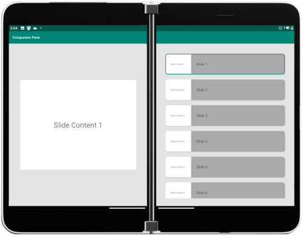

# CompanionPane sample for Surface Duo with Xamarin.Android

Read about the [Companion pane user experience](https://docs.microsoft.com/dual-screen/introduction#companion-pane) and visit the [docs page](https://docs.microsoft.com/dual-screen/android/sample-code/companion-pane) for more information.

## Related links

- [Introduction to dual-screen devices](https://docs.microsoft.com/dual-screen/introduction)
- [Get the Surface Duo emulator](https://docs.microsoft.com/dual-screen/android/emulator/)
