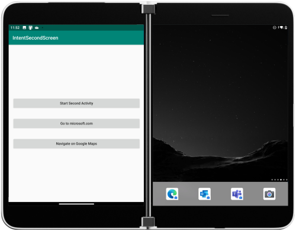
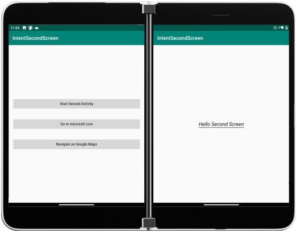

# Intent to second screen sample for Surface Duo (using C# and Xamarin)

This sample demonstrates how to cause an activity to open on the second screen (as long as it's empty, otherwise the activity will launch over the current one).

In the main activity, choose an option to start: another activity from the current app or a URL in a browser window:



If the launcher is still visible on the other screen, the new activity will appear there:



The sample uses these functions to set the intent flags required to start on the second screen if available:

```csharp
void StartIntentSecondActivity()
{
    var intent = new Intent(this, typeof(SecondActivity));
    // Intent.FLAG_ACTIVITY_LAUNCH_ADJACENT is required to launch a second activity
    // on a second display while still keeping the first activity on the first display
    // (not pausing/stopping it)
    intent.AddFlags(ActivityFlags.LaunchAdjacent | ActivityFlags.NewTask);
    StartActivity(intent);
}

void StartIntentBrowserApp(string url)
{
    var intent = new Intent(Intent.ActionView, Android.Net.Uri.Parse(url));
    intent.AddFlags(ActivityFlags.LaunchAdjacent | ActivityFlags.NewTask);
    StartActivity(intent);
}
```

## Related links

- [Launch intent to second screen docs](https://docs.microsoft.com/dual-screen/android/sample-code/launch-to-second-screen/)
- [Introduction to dual-screen devices](https://docs.microsoft.com/dual-screen/introduction)
- [Get the Surface Duo emulator](https://docs.microsoft.com/dual-screen/android/emulator/)
