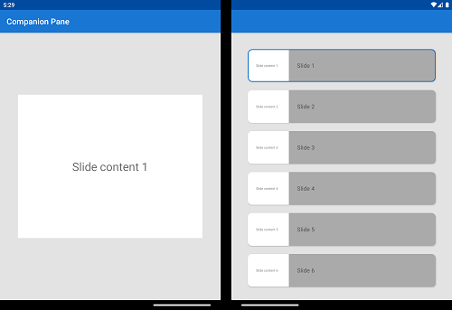
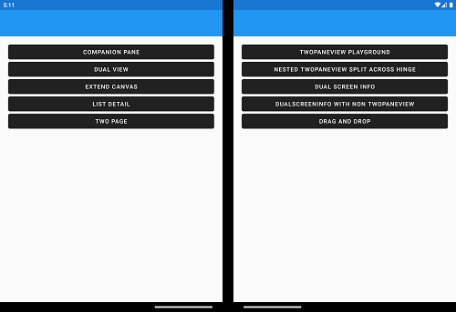

# Surface Duo - Xamarin SDK samples

This repository contains Xamarin.Android and Xamarin.Forms  samples for Surface Duo, all accessible from a single Visual Studio solution. The samples covers all [dual-screen app patterns from Microsoft docs](https://docs.microsoft.com/dual-screen/introduction#dual-screen-app-patterns).

## Get Started

To learn how to load your app on to emulator, and to use it, refer to the [Surface Duo developer docs](https://docs.microsoft.com/dual-screen/xamarin) and [Xamarin.Forms dual-screen docs](https://docs.microsoft.com/xamarin/xamarin-forms/app-fundamentals/dual-screen/).

## Prerequisites

Before running the samples, be sure that you have the following items installed on and attached to your computer:

- [Visual Studio](https://visualstudio.microsoft.com/) 2019 for Mac or Windows
- Installed *Mobile with .NET* Visual Studio workload
- Installed [Surface Duo emulator](https://www.microsoft.com/download/details.aspx?id=100847) or connected device

## Contents
This repository features native Xamarin.Android and Xamarin.Forms samples for [different approaches how to work with two screens](https://docs.microsoft.com/dual-screen/introduction).

Be sure the Surface Duo emulator is already running or your device is attached to your computer. Select the target of your choicet from the Visual Studio device list before running the sample.

The Surface Duo 2 emulator will appear as `<build> (Android 11.0 - API 30)`.

### Xamarin.Android
Every sample of Xamarin.Android is a runable project. To start for example the `CampanionPane` sample, expand the `Xamarin.Android Native` folder and set the related sample as *Startup project*.

#### CompanionPane
The `companion pane` pattern is a great opportunity to take advantage of added screen real-estate by taking second-level surfaces that are otherwise hidden and exposing them when the app is spanned.

- [Code sample](https://github.com/microsoft/surface-duo-sdk-xamarin-samples/tree/main/CompanionPane) in repository
- [Microsoft docs](https://docs.microsoft.com/dual-screen/introduction#companion-pane) page

#### DragAndDrop
Support for drag-and-drop ensures a great user experience using all the different input types supported by the Surface Duo.

This sample demonstrates how to implement drag-and drop in your Android app, following the [Android drag and drop guidance](https://developer.android.com/guide/topics/ui/drag-drop).

- [Code sample](https://github.com/microsoft/surface-duo-sdk-xamarin-samples/tree/main/DragAndDrop) in repository
- [Microsoft docs](https://docs.microsoft.com/dual-screen/xamarin/drag-drop) page

#### DualView
Having two screens provides a natural affordance to compare and contrast two versions of the same type of content side-by-side, like two images, lists, or documents.

It can also be used to show the same information in two different ways at the same time, with each screen working seamlessly to provide more information to the user. For example, a list of restaurants on one screen, and a map with locations on the other.

- [Code sample](https://github.com/microsoft/surface-duo-sdk-xamarin-samples/tree/main/DualView) in repository
- [Microsoft docs](https://docs.microsoft.com/dual-screen/introduction#dual-view) page

#### ExtendedCanvas
The *extended canvas* pattern is the simplest dual-screen pattern, but it's powerful. You may consider this pattern if you need a bigger canvas for a task such as drawing, or if your app has a free-flowing canvas that the user can freely scroll to avoid the seam if some important content is obscured. This provides the benefit of giving your app more screen real-estate, rather than constricting it to one screen or another.

This pattern only applies to the canvas portion of the UI. You may still need to use one of the other techniques to accommodate the seam if it will obscure the non-canvas portion of the app.

- [Code sample](https://github.com/microsoft/surface-duo-sdk-xamarin-samples/tree/main/ExtendCanvas) in repository
- [Microsoft docs](https://docs.microsoft.com/dual-screen/introduction#extended-canvas) page

#### IntentToSecondScreen
This sample demonstrates how to cause an activity to open on the second screen (as long as it's empty, otherwise the activity will launch over the current one).

In the main activity, choose an option to start: another activity from the current app or a URL in a browser window:
- [Code sample](https://github.com/microsoft/surface-duo-sdk-xamarin-samples/tree/main/IntentToSecondScreen) in repository

#### ListDetail
The *list-detail* pattern has a main pane (usually with a list view) and a details pane for content. When an item in the list is selected, the details pane is updated. This pattern is naturally good for when you have a wider viewing area. It is frequently used for email and address books.

Taking advantage of the two distinct screens and snapping to the natural boundary, you could use one screen to show the "items" list and the other to show details of the selected item.

- [Code sample](https://github.com/microsoft/surface-duo-sdk-xamarin-samples/tree/main/ListDetail) in repository
- [Microsoft docs](https://docs.microsoft.com/dual-screen/introduction#list-detail) page

#### TwoPage
Some apps naturally tend to a book-like paging experience. You can use the natural boundary to show several items from a collection -like pages or pictures - which otherwise might have required the user to view one at a time.

Depending on your app, you could decide to paginate per 2 pages or advance one page at a time.
- [Code sample](https://github.com/microsoft/surface-duo-sdk-xamarin-samples/tree/main/TwoPage) in repository
- [Microsoft docs](https://docs.microsoft.com/dual-screen/introduction#two-page) page

#### WindowManager
Visit the [Window Manager for Xamarin docs](https://docs.microsoft.com/dual-screen/xamarin/) for more information on using Window Manager in your apps.

### Xamarin.Forms
All samples on how to use the SDK using Xamarin.Forms are in one sample app. Expand the solution's `Xamarin.Forms` folder and ensure the `DualScreenDemos.Android` project is the *startup project*.

#### TwoPane
The `TwoPaneView playground` lets you experiment with the different layout options it supports. [Read the TwoPaneView docs](https://docs.microsoft.com/dual-screen/xamarin/twopaneview) for details on how to control the layout.

#### CompanionPane

The `companion pane` pattern is a great opportunity to take advantage of added screen real-estate by taking second-level surfaces that are otherwise hidden and exposing them when the app is spanned.

- [Microsoft docs](https://docs.microsoft.com/dual-screen/introduction#companion-pane) page

#### DualView
Having two screens provides a natural affordance to compare and contrast two versions of the same type of content side-by-side, like two images, lists, or documents.

It can also be used to show the same information in two different ways at the same time, with each screen working seamlessly to provide more information to the user. For example, a list of restaurants on one screen, and a map with locations on the other.

- [Microsoft docs](https://docs.microsoft.com/dual-screen/introduction#dual-view) page

#### and many more
The sample itself uses diffrent controls itself that brings the unique features of dual screen devices to life. Other examples are focuses on diffrent APIs like the `Xamarin.Forms DualScreenInfo API`. [Read the Microsoft docs article](https://docs.microsoft.com/dual-screen/xamarin/dualscreeninfo) for further information.

### (Optional) Add API keys

To use the **DualView** and **ExtendCanvas** samples, you will first need to create an Google Map API key. Follow the instructions outlined [here](https://developers.google.com/maps/documentation/javascript/get-api-key) to create an API key.

After you have an API key, put it in the following files:

- `DualView/Resources/Assets/googlemap.html`
- `ExtendCanvas/Resources/Assets/googlemapsearch.html`
- `XamarinForms/Xamarin.Duo.Forms.Samples.Android/Assets/googlemap.html`
- `XamarinForms/Xamarin.Duo.Forms.Samples.Android/Assets/googlemapsearch.html`

By replacing `YOUR_API_KEY` string with your actual key the map views will be displayed.

## Related links

- [App samples](https://github.com/microsoft/surface-duo-app-samples)
- [SDK samples (Java)](https://github.com/microsoft/surface-duo-sdk-samples)
- [SDK samples (Kotlin)](https://github.com/microsoft/surface-duo-sdk-samples-kotlin)
- [Unity samples](https://github.com/microsoft/surface-duo-sdk-unity-samples)
- [Xamarin samples](https://github.com/microsoft/surface-duo-sdk-xamarin-samples)
- [Flutter samples](https://github.com/microsoft/surface-duo-sdk-samples-flutter)
- [React Native samples](https://github.com/microsoft/react-native-dualscreen)
- Web samples are coming soon

## Contributing

This project welcomes contributions and suggestions.  Most contributions require you to agree to a
Contributor License Agreement (CLA) declaring that you have the right to, and actually do, grant us
the rights to use your contribution. For details, visit https://cla.opensource.microsoft.com.

When you submit a pull request, a CLA bot will automatically determine whether you need to provide
a CLA and decorate the PR appropriately (e.g., status check, comment). Simply follow the instructions
provided by the bot. You will only need to do this once across all repos using our CLA.

This project has adopted the [Microsoft Open Source Code of Conduct](https://opensource.microsoft.com/codeofconduct/).
For more information see the [Code of Conduct FAQ](https://opensource.microsoft.com/codeofconduct/faq/) or
contact [opencode@microsoft.com](mailto:opencode@microsoft.com) with any additional questions or comments.