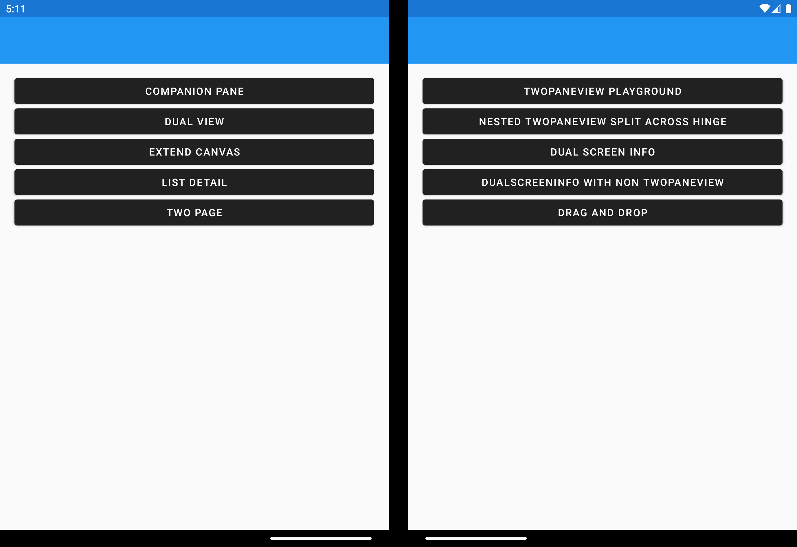

# Surface Duo - Xamarin SDK samples

This repo contains Xamarin and Xamarin.Forms Android samples for Surface Duo, all accessible from a single Visual Studio solution.

## Get Started

To learn how to load your app on to emulator, and to use it, refer to the [Surface Duo developer docs](https://docs.microsoft.com/dual-screen/xamarin) and [Xamarin.Forms dual-screen docs](https://docs.microsoft.com/xamarin/xamarin-forms/app-fundamentals/dual-screen/).

## Build and Test

### Xamarin.Forms

1. Open the **Xamarin.Duo.Samples** solution
2. Expand the **Xamarin.Forms** folder and ensure the **DualScreenDemos.Android** project is the startup project
3. Start the Surface Duo emulator - once it has started it will appear in the Visual Studio device list
4. Run the project, and you will see a menu of different examples to try:

    

The TwoPaneView playground lets you experiment with the different layout options it supports. Read the [TwoPaneView docs](https://docs.microsoft.com/dual-screen/xamarin/twopaneview) for details on how to control the layout.

### Xamarin.Android

1. Open the **Xamarin.Duo.Samples** solution
2. Expand the **Xamarin.Android native** folder 
3. Choose one of the projects listed as the startup project (eg. Companion Pane, DragAndDrop, DualView, ExtendCanvas, IntentToSecondScreen, MasterDetail, TwoPage)
4. Start the Surface Duo emulator - once it has started it will appear in the Visual Studio device list
5. Run the project
6. Change the startup project to try each sample

### API keys

To use the **DualView** and **ExtendCanvas** samples, you will first need to create an Google Map API key. Follow the instructions outlined [here](https://developers.google.com/maps/documentation/javascript/get-api-key) to create an API key.

After you have an API key, put it in the following files:

- DualView/Resources/Assets/googlemap.html
- ExtendCanvas/Resources/Assets/googlemapsearch.html
- XamarinForms/Xamarin.Duo.Forms.Samples.Android/Assets/googlemap.html
- XamarinForms/Xamarin.Duo.Forms.Samples.Android/Assets/googlemapsearch.html

By replacing `YOUR_API_KEY` string with your actual key the map views will be displayed.

## Contributing

This project welcomes contributions and suggestions.  Most contributions require you to agree to a
Contributor License Agreement (CLA) declaring that you have the right to, and actually do, grant us
the rights to use your contribution. For details, visit https://cla.opensource.microsoft.com.

When you submit a pull request, a CLA bot will automatically determine whether you need to provide
a CLA and decorate the PR appropriately (e.g., status check, comment). Simply follow the instructions
provided by the bot. You will only need to do this once across all repos using our CLA.

This project has adopted the [Microsoft Open Source Code of Conduct](https://opensource.microsoft.com/codeofconduct/).
For more information see the [Code of Conduct FAQ](https://opensource.microsoft.com/codeofconduct/faq/) or
contact [opencode@microsoft.com](mailto:opencode@microsoft.com) with any additional questions or comments.
