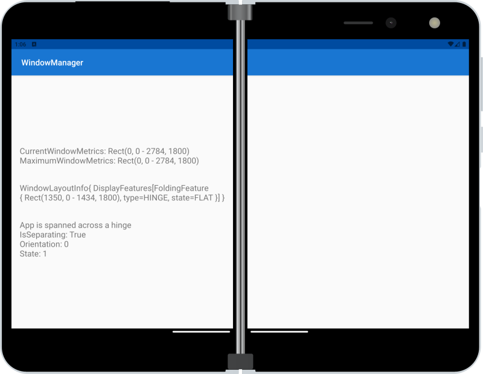

# Window Manager sample for Surface Duo with Xamarin.Android

Visit the [Window Manager for Xamarin docs](https://docs.microsoft.com/dual-screen/xamarin/) for more information on using Window Manager in your apps.

> NOTE: uses Xamarin.Android.Window.WindowJava-1.0.0.1-beta01, based on Jetpack Window Manager beta01 packages

## Related links

- [Introduction to dual-screen devices](https://docs.microsoft.com/dual-screen/introduction)
- [Get the Surface Duo emulator](https://docs.microsoft.com/dual-screen/android/emulator/)
- [Xamarin.Android documentation](https://docs.microsoft.com/xamarin/android/)
