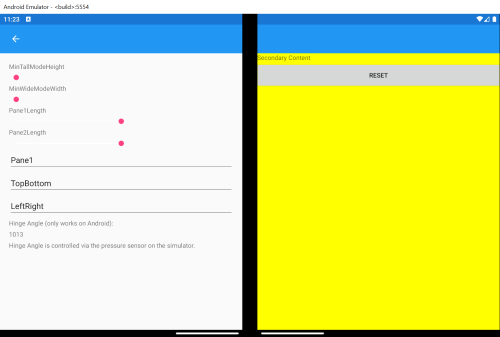

# Xamarin.Forms sample for Surface Duo

This solution contains two projects:

- **DualScreenDemos** - the Xamarin.Forms shared-code for this sample.
- **DualScreenDemos.Android** - the Android app (set this as the Startup Project).

The code uses the [Xamarin.Forms.DualScreen](https://www.nuget.org/packages/Xamarin.Forms.DualScreen/) NuGet package to enable Surface Duo-specific dual-screen functionality.

The menu of options available in the sample is shown below. It includes basic demonstrations of each of the five [dual-screen UX patterns](https://docs.microsoft.com/dual-screen/introduction#dual-screen-app-patterns) as well as the TwoPaneView playground:

The TwoPaneView control is a new layout optimized for the Surface Duo, but which provides a powerful split-view control that works on all platforms:

## Related links

- [Introduction to dual-screen devices](https://docs.microsoft.com/dual-screen/introduction)
- [Get the Surface Duo emulator](https://docs.microsoft.com/dual-screen/android/emulator/)
- [Surface Duo Xamarin developer docs](https://docs.microsoft.com/dual-screen/xamarin/)
- [Xamarin.Forms docs](https://docs.microsoft.com/xamarin/xamarin-forms/app-fundamentals/dual-screen/)
